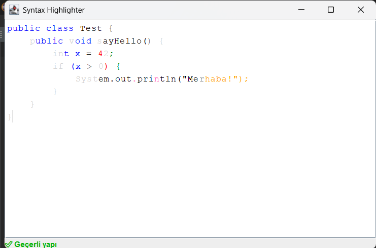

# Gerçek Zamanlı Gramer Tabanlı Sözdizimi Renklendirici ve Arayüz

  
*Uygulamanın çalışırken bir ekran görüntüsü.*

## Genel Bakış
Bu proje, **Gerçek Zamanlı Gramer Tabanlı Sözdizimi Renklendirici ve Arayüz**, Java ve Swing kullanılarak geliştirilmiş bir mini-IDE prototipidir. Java dilinin bir alt kümesi için gerçek zamanlı sözdizimi renklendirme ve gramer tabanlı hata tespiti sağlar. Kullanıcı metni yazarken, metin token'lara ayrılır, sözdizimi analizi yapılır, farklı token türleri belirgin renklerle renklendirilir ve hatalı kısımlar kırmızı alt çizgiyle işaretlenir. Durum çubuğu, kullanıcı yazarken anında geri bildirim verir (`✅ Geçerli yapı` veya `❌ Hata: ...`).

### Temel Özellikler
- **Gerçek Zamanlı Sözdizimi Renklendirme**: 7 farklı token türünü destekler ve her biri için belirgin renkler kullanılır:
  - `KEYWORD`: Mavi (#0000FF) – örneğin, `if`, `for`, `while`
  - `NUMBER`: Yeşil (#008000) – örneğin, `10`, `3.14`
  - `STRING`: Turuncu (#FFA500) – örneğin, `"Merhaba"`
  - `OPERATOR`: Kırmızı (#FF0000) – örneğin, `+`, `=`, `>`
  - `IDENTIFIER`: Siyah (#000000) – örneğin, `x`, `myMethod`
  - `PARENTHESIS`: Gri (#808080) – örneğin, `{`, `}`, `;`
  - `COMMENT`: Gri, italik (#808080) – örneğin, `// Not`
- **Gramer Analizi**: Java dilinin bir alt kümesini destekler:
  - Değişken tanımları: `int x = 5;`
  - Kontrol yapıları: `if`, `while`, `for` (iç içe yapılar dahil)
  - Sınıf ve metot tanımları: `public class MyClass { public void myMethod() { ... } }`
  - Atama ve `println` ifadeleri: `x = x + 1;`, `System.out.println("Sonuç: " + x);`
- **Hata Tespiti**: Geçersiz sözdizimi kırmızı alt çizgiyle işaretlenir ve durum çubuğunda hata mesajı gösterilir (örneğin, `❌ Hata: if bloğunda ')' eksik`).
- **Performans Optimizasyonu**: Hızlı yazma sırasında renklendirmeyi geciktirmek için `Timer` ve `DocumentListener` kullanılır, böylece akıcı bir deneyim sağlanır.

## Proje Yapısı
Proje, Java ile geliştirilmiştir ve aşağıdaki ana sınıfları içerir:
- **`LexicalAnalyzer`**: Girdi metnini token'lara ayırır ve **State Diagram & Program Implementation** yaklaşımını kullanır. 7 farklı token türünü tanımlar ve renklendirme için pozisyonlarını kaydeder.
- **`SyntaxAnalyzer`**: Gramer analizi yapar ve **Top-Down Parsing** yöntemini kullanır. Java yapılarını doğrular, hataları tespit eder ve hata pozisyonlarıyla birlikte mesajlar döndürür.
- **`Highlighter`**: Gerçek zamanlı renklendirme mantığını yönetir, token türlerini renklerle eşleştirir ve `JTextPane` üzerinde stilleri uygular.
- **`EditorPanel`**: Swing ile geliştirilmiş ana arayüz sınıfıdır. Analizci, renklendirici ve durum çubuğunu bir araya getirerek kullanıcı dostu bir arayüz sunar.

## Kurulum
### Gereksinimler
- Java Development Kit (JDK) 11 veya üzeri
- Java IDE (örneğin, IntelliJ IDEA, Eclipse) veya komut satırı derleme araçları

### Adımlar
1. Depoyu klonlayın:
   ```bash
   git clone https://github.com/kullanıcı-adınız/syntax-highlighter.git
   ```
2. Proje dizinine gidin:
   ```bash
   cd syntax-highlighter
   ```
3. Projeyi derleyin:
   ```bash
   javac EditorPanel.java
   ```
4. Uygulamayı çalıştırın:
   ```bash
   java EditorPanel
   ```

## Kullanım
1. Uygulamayı çalıştırdığınızda, bir metin editörü penceresi açılır.
2. Java kodunuzu yazmaya başlayın. Desteklenen yapılar:
   - Değişken tanımlama: `int x = 5;`
   - Kontrol yapıları: 
     ```java
     if (x > 0) { System.out.println("Merhaba"); }
     for (int i = 0; i < 5; i++) { ... }
     ```
   - Sınıf ve metot: `public class MyClass { public void myMethod() { ... } }`
3. Kod yazarken token'lar anında renklendirilir:
   - Anahtar kelimeler mavi, sayılar yeşil, string'ler turuncu olur.
   - Hatalı yapılar (örneğin, eksik `;`) kırmızı alt çizgiyle işaretlenir.
4. Durum çubuğu, kodun geçerliliğini gösterir: `✅ Geçerli yapı` veya `❌ Hata: ...`.

## Örnek Kullanım
Aşağıdaki kodu yazmayı deneyin:
```java
public class Test {
    public void run() {
        int x = 10;
        if (x > 5) {
            System.out.println("x büyük");
        }
    }
}
```
- `public`, `class`, `if` gibi anahtar kelimeler mavi renkte görünecek.
- `10` yeşil, `"x büyük"` turuncu olacak.
- Kod doğruysa durum çubuğunda `✅ Geçerli yapı` mesajı görünecek.

Hatalı bir yapı deneyin:
```java
if (x > 0 {
```
- `{` altında kırmızı alt çizgi olacak.
- Durum çubuğu `❌ Hata: if bloğunda ')' eksik` mesajını gösterecek.

##  Video linki
- **Videosu**: [YouTube Linki]([https://youtube.com/demo-link](https://www.youtube.com/watch?v=ww7JLAVdDgs)) *(Yüklenmediyse linki güncelleyin)*


## Gelecek Geliştirmeler
- `else`, `switch` gibi yapıların desteklenmesi.
- Sembol tablosu ile semantik analiz (örneğin, değişken tanımlı mı kontrolü).
- Satır numaraları ve otomatik tamamlama özellikleri.
- Koyu/aydınlık tema desteği.


